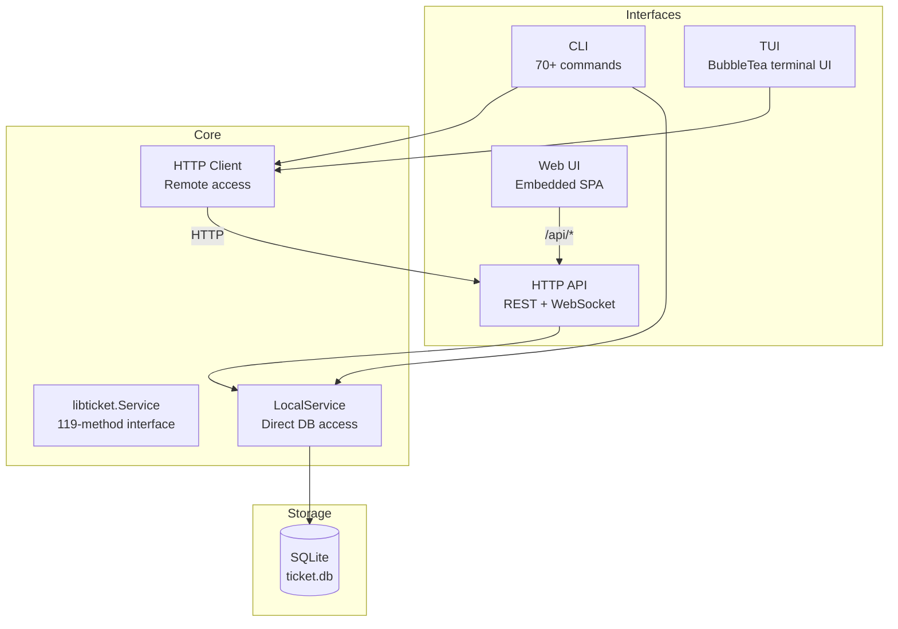
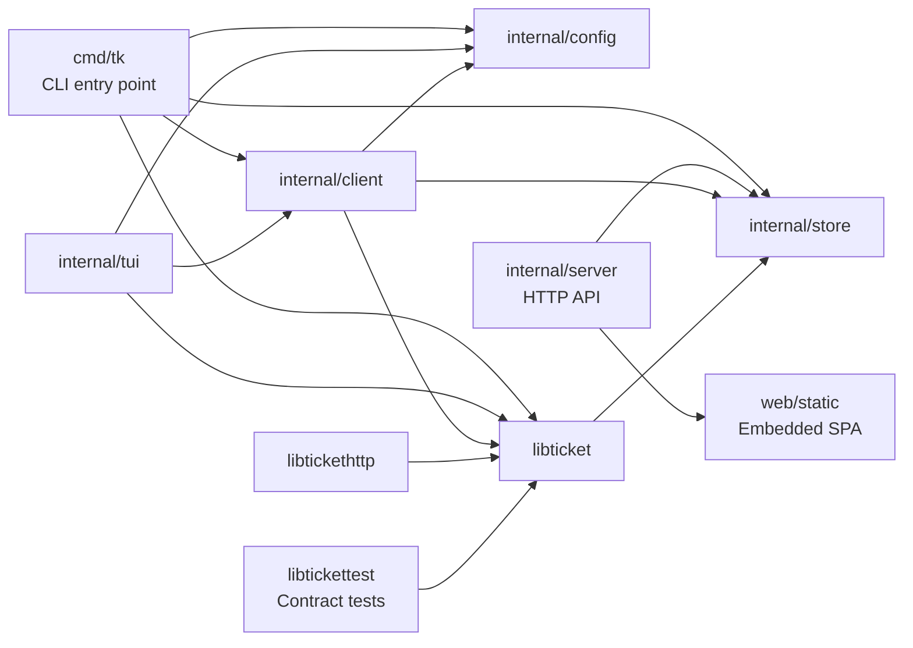
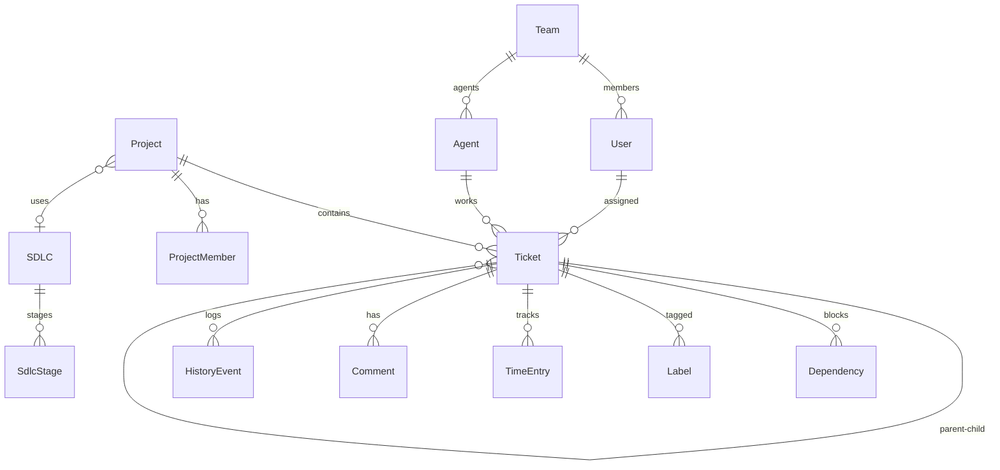
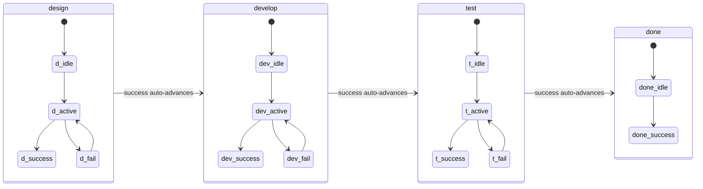
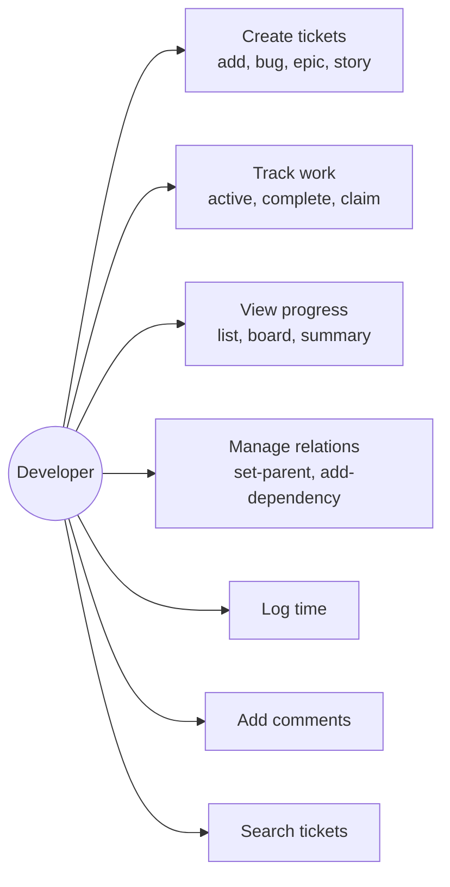
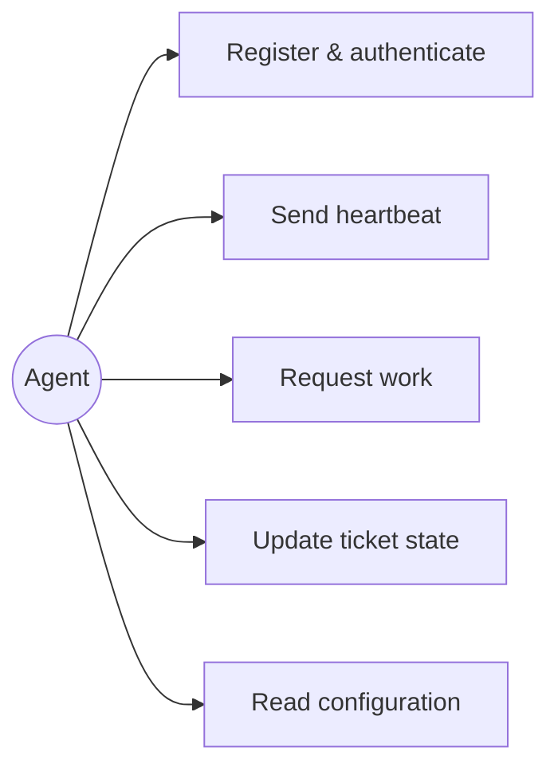
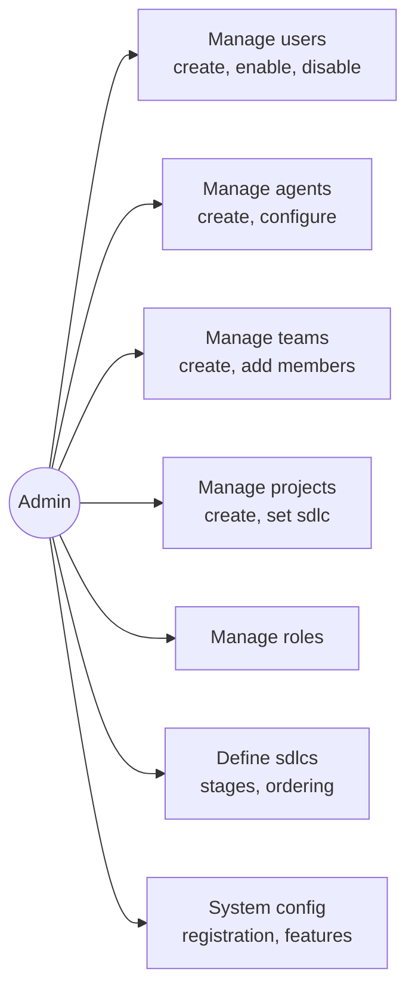
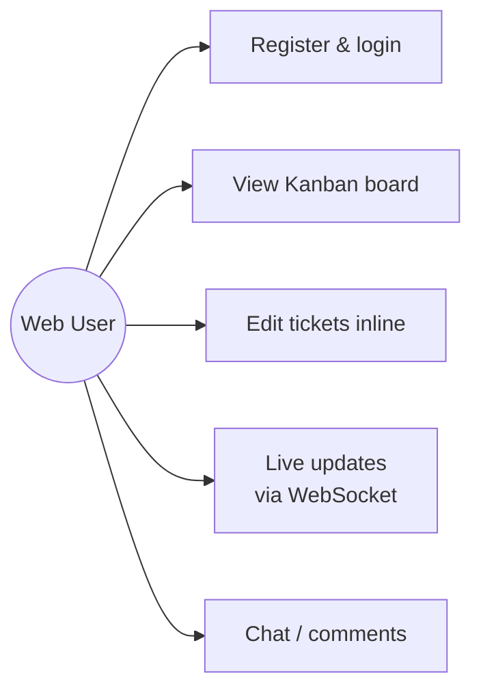
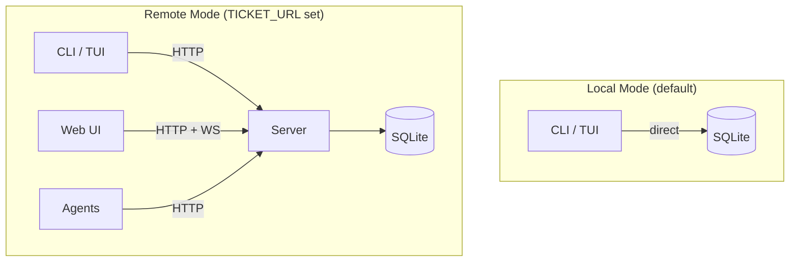

# ticket

`ticket` is an issue tracking toolkit for software engineering.  It is a single Go binary that provides a CLI, a terminal UI, a web UI, and a REST API — all backed by SQLite.

```
brew install simonski/tap/ticket
```

---

## Introduction

`ticket` tracks engineering work through a lightweight lifecycle:

| Concept | Example |
|---------|---------|
| Project | `CUS` — Customer Portal |
| Ticket key | `CUS-T-42` |
| Ticket types | `epic`, `task`, `bug`, `story`, `spike`, `chore`, `note`, `question`, `requirement`, `decision` |
| Lifecycle | `stage/state` — e.g. `develop/active` |
| Stages | `design → develop → test → done` |
| States | `idle`, `active`, `success`, `fail` |

Setting a ticket's state to `success` automatically advances it to the next stage.

It works in two modes:

- **Local** — CLI and TUI operate directly on a SQLite file. No server required.
- **Server** — HTTP server adds multi-user auth, a web Kanban board, WebSocket live updates, and AI agent support.

The authoritative system contract is in [SPEC.md](./SPEC.md). Full user-facing documentation is in [USER_GUIDE.md](./USER_GUIDE.md). Architecture and design notes are in [docs/DESIGN.md](./docs/DESIGN.md).

## Start here

If you're new to the repo, read these first:

1. [QUICKSTART.md](./QUICKSTART.md) - choose local or server mode
2. [docs/ONBOARDING.md](./docs/ONBOARDING.md) - setup, reading order, and common pitfalls
3. [CLAUDE.md](./CLAUDE.md) - build/test commands, architecture, and package map
4. [CONTRIBUTING.md](./CONTRIBUTING.md) - branch naming, commit style, and PR expectations

## Installation

### Homebrew (macOS / Linux)

```bash
brew install simonski/tap/ticket
```

Installs as `tk`.

### Go install

```bash
go install github.com/simonski/ticket/cmd/tk@latest
```

### Download a binary

Download a tarball for your platform from the [releases page](https://github.com/simonski/ticket/releases), extract it, and put `ticket` on your `PATH`.

---

## Build from source

```bash
git clone https://github.com/simonski/ticket
cd ticket
make setup        # install Go tools, Node, Playwright
make build
```

New to the codebase? See [docs/ONBOARDING.md](docs/ONBOARDING.md) for the guided setup, reading order, workflow expectations, and newcomer gotchas.

Run the tests:

```bash
make test
```

---

## Usage

### Quick start (local)

```bash
tk init                                          # create a repo-local .ticket/ workspace
tk add "First ticket"
tk list
```

See [QUICKSTART.md](./QUICKSTART.md) for a full walkthrough.

### Command structure

```
tk <noun> <verb> [flags]
```

| Noun | Common verbs |
|------|-------------|
| `ticket` | `ls`, `new`, `get`, `update`, `rm`, `state`, `assign`, `close` |
| `idea` | `ls`, `new`, `get`, `shape`, `accept`, `reject` |
| `project` | `ls`, `new`, `get`, `use`, `rm`, `init` |
| `dep` | `add`, `remove` |
| `label` | `ls`, `new`, `rm`, `add`, `remove` |
| `time` | `log`, `ls`, `total`, `rm` |
| `story` | `ls`, `new`, `get`, `update`, `rm` |
| `decision` | `ls`, `new` |
| `role` | `ls`, `new`, `get`, `update`, `rm` |
| `sdlc` | `ls`, `new`, `get`, `rm`, `set`, `unset` |
| `team` | `ls`, `new`, `update`, `rm` |
| `agent` | `ls`, `new`, `update`, `rm`, `run` |
| `user` | `ls`, `new`, `rm`, `enable`, `disable` |

**Shortcuts:**

```bash
tk add "Fix login bug"                    # create a task
tk bug "Token expires too early"          # create a bug
tk epic "Authentication"                  # create an epic
tk idea new "Add dark mode"               # capture a requirement
tk ls                                     # list open tickets
tk summary                                # daily starting-point overview
```

### Ticket lifecycle

```bash
tk active -id MY-T-1      # begin work  (develop/active)
tk complete -id MY-T-1    # finish stage, auto-advance
tk idle -id MY-T-1        # pause
tk complete -id MY-T-1    # mark ticket complete
```

### TUI

```bash
tk -g
```

Launches a full-screen terminal UI. Navigate with Tab / arrow keys.  
Tabs: **Home · Projects · Ideas · Tickets · SDLCs · Config**

### Web server

```bash
tk server                  # start on :8080
```

Opens a Kanban board with live WebSocket updates at `http://localhost:8080`.

See [QUICKSTART_SERVER.md](./QUICKSTART_SERVER.md) for multi-user server setup.

---

## AI agent support

`ticket` can run an AI coding agent that picks up ready tickets and works on them autonomously.

```bash
tk agent create                        # prints agent UUID and password
export AGENT_ID=<uuid>
export AGENT_PASSWORD=<password>
export TICKET_URL=http://localhost:8080
tk agent run                           # default LLM: claude (Sonnet)
tk agent run -llm codex                # use codex
tk agent run -v                        # stream LLM I/O to terminal
```

Custom `-llm` binaries are only allowed when explicitly added to
`TICKET_AGENT_ALLOWED_LLM_BINARIES` (comma-separated names).

Only non-draft tickets are eligible. Use `tk undraft -id <id>` to make a ticket available.

### Claude Code skill

A Claude Code skill ships in `.claude/skills/tk/`. Copy it into your project's
`.claude/skills/` directory (or `~/.claude/skills/` for all projects) and Claude
will query and update tickets automatically during coding sessions.

---

## Environment variables

| Variable | Purpose |
|----------|---------|
| `TICKET_HOME` | Override the config/database directory. Otherwise `tk` uses `.ticket/` at the nearest Git root, or `.ticket/` in the current directory if no Git root exists |
| `TICKET_URL` | Connect to a remote server (`http(s)://host:port`) |
| `TICKET_USERNAME` | Default username for remote login |
| `TICKET_PASSWORD` | Default password for remote login |
| `TICKET_TRUSTED_PROXY_CIDRS` | Comma-separated CIDRs trusted as reverse proxies for `X-Forwarded-For`/`X-Forwarded-Proto` handling |
| `AGENT_ID` | Agent UUID for `tk agent run` |
| `AGENT_PASSWORD` | Agent password for `tk agent run` |
| `TICKET_AGENT_LLM` | Override the LLM command (default: `claude`) |
| `TICKET_AGENT_ALLOWED_LLM_BINARIES` | Additional allow-listed binary names for `tk agent run -llm` (default allow-list: `claude`, `codex`) |

`TICKET_CHAT_CMD` and `TICKET_ANALYSE_CMD` execute server-side processes. Treat
them as trusted operator-only configuration and never source their values from
untrusted input.

---

## Architecture

A single Go binary provides four interfaces to the same data:



### Package Dependencies



### Data Model



### Ticket Lifecycle



## Use Cases

### Developer



### Agent



### Admin



### Web User



### Deployment Modes


