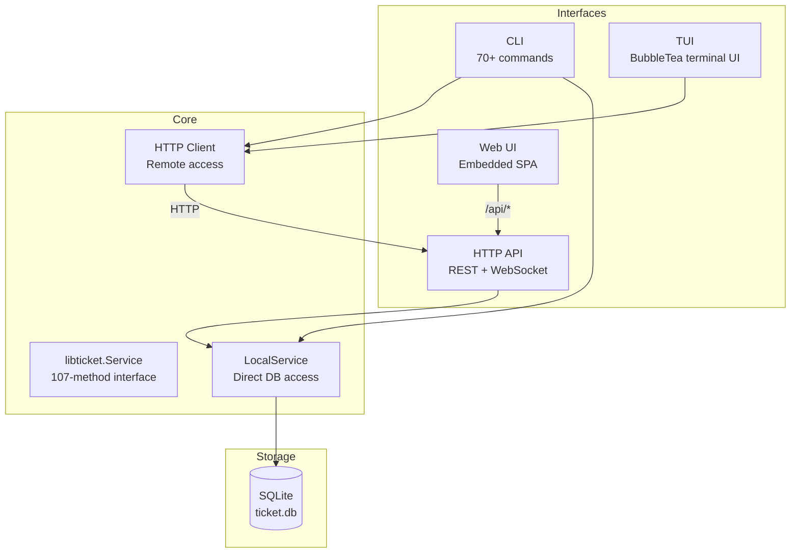
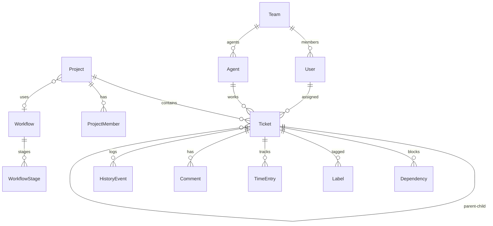
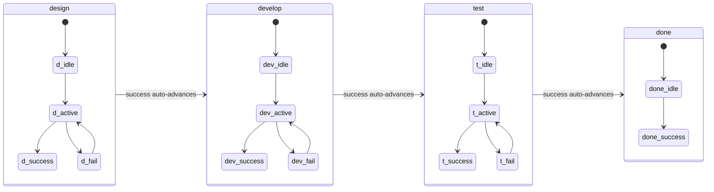
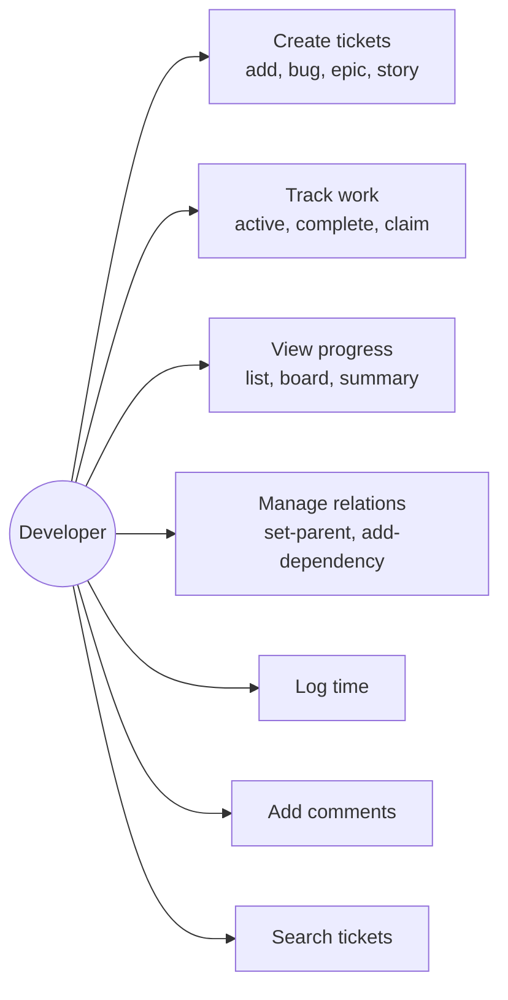
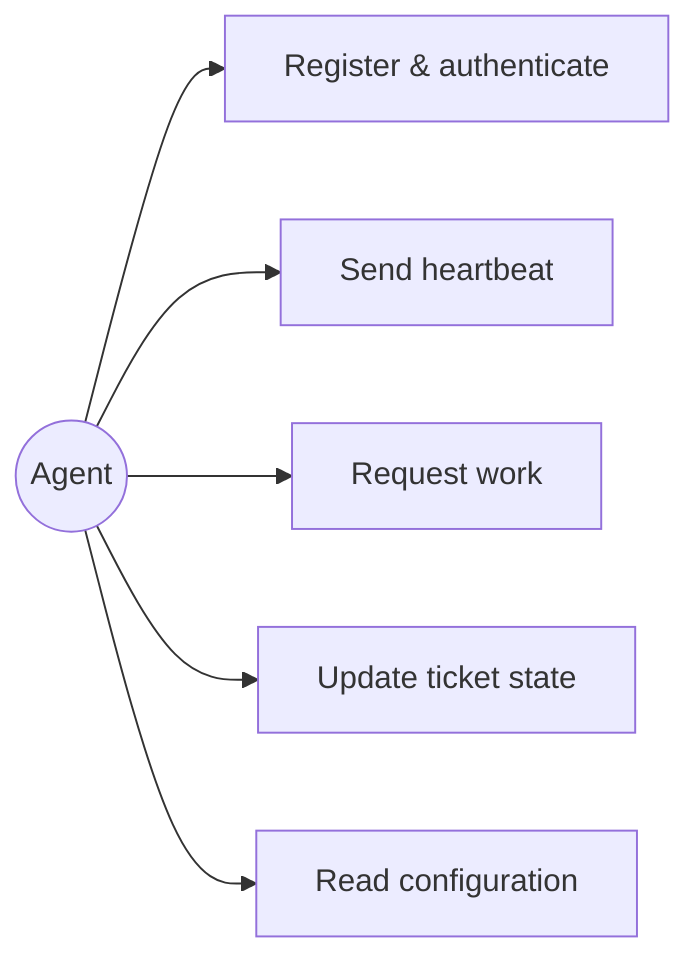
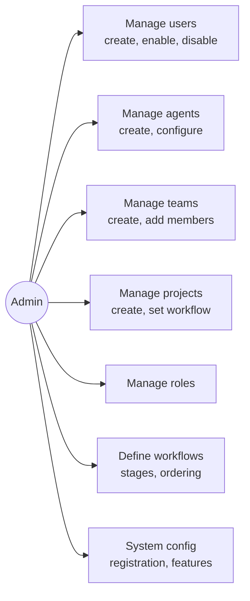
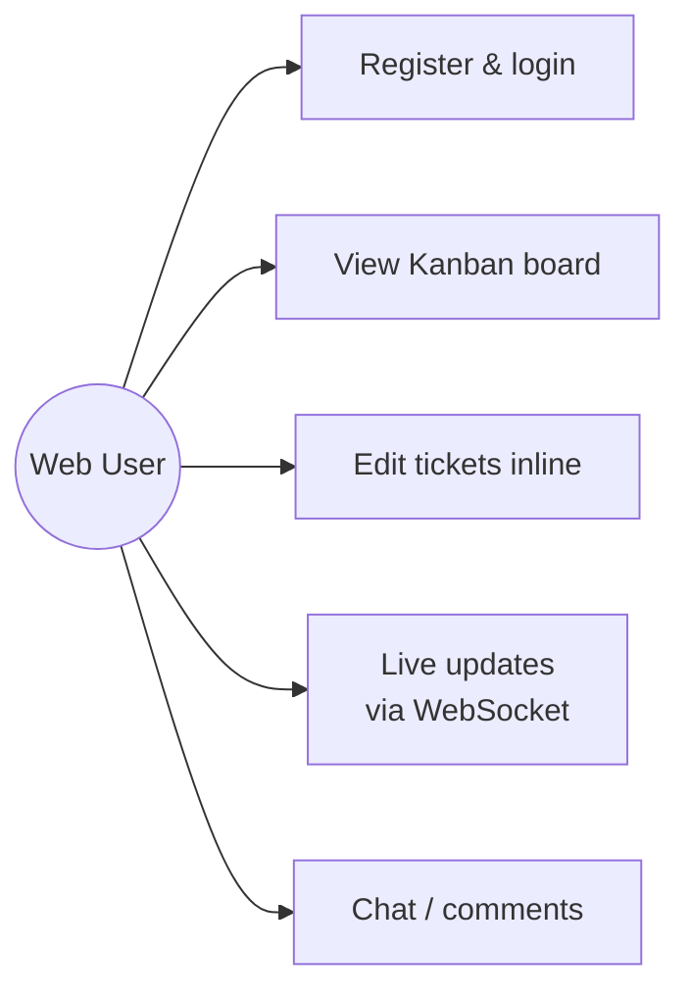
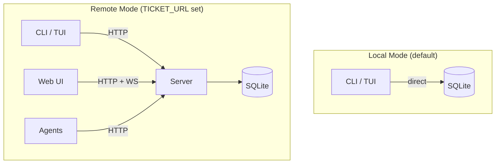

# ticket

`ticket` is a ticket and project management system for software engineering work.

It models:

- projects with unique prefixes such as `CUS`
- tickets with human keys such as `CUS-42`
- ticket types `epic`, `task`, `bug`, `story`, `requirement`, `decision`, `question`, and `note`
- lifecycle as `stage/state`, for example `develop/active`
- stages: `design → develop → test → done`
- states: `idle | active | success | fail`
  - `idle`: ready but not currently in progress
  - `active`: currently being worked on (requires an assignee)
  - `success`: stage complete, auto-advances to next stage
  - `fail`: stage did not succeed

The authoritative system contract is in [SPEC.md](./SPEC.md). User-facing
workflow details are in [USER_GUIDE.md](./USER_GUIDE.md). Implementation and
architecture notes are in [docs/DESIGN.md](./docs/DESIGN.md).

## Architecture

A single Go binary provides four interfaces to the same data:



### Package Dependencies


### Data Model



### Ticket Lifecycle



## Use Cases

### Developer



### Agent



### Admin



### Web User



### Deployment Modes



## Install

```bash
brew install simonski/tap/ticket
```

Both `ticket` and the alias `tk` are installed.

or

```bash
go install github.com/simonski/ticket/cmd/ticket@latest
alias tk=ticket
```

## Build from source

```bash
cd $CODE
git clone github.com/simonski/ticket
cd ticket
make install
```

## Test

```bash
make test
```

## Usage

In your project, run

```bash
tk init
```

You can now create tickets

```bash
tk add "Create a skeleton project in go."
```

```bash
claude -p "work on next ticket"
```


## Web Server

Start the server and web UI:

```bash
tk server
```

The web UI is then available at `http://localhost:8080`.

## CLI Quick Start

Create a project:

```bash
ticket project create -prefix CUS -title "Customer Portal"
ticket project use CUS
```

Create tickets:

```bash
ticket epic "Authentication"
ticket add "Customers can reset their password."
ticket bug "Reset token expires immediately."
```

Inspect and move work:

```bash
ticket list
ticket get -id CUS-T-42
ticket active -id CUS-T-42
ticket complete -id CUS-T-42
ticket claim -id CUS-T-42
```

## Running an agent

Create an agent (requires a running server):

```bash
tk agent create
```

This prints the agent UUID and a generated password.

Run the agent worker:

```bash
export AGENT_ID=<uuid>
export AGENT_PASSWORD=<generated-password>
export TICKET_URL=http://localhost:8080
tk agent run
```

or with flags:

```bash
tk agent run -id <uuid> -url http://localhost:8080
```

The password is read from the `AGENT_PASSWORD` environment variable, or prompted interactively (input masked with `*`).

Options: `-llm claude` (default, uses Sonnet 4.5), `-llm codex`, or `-llm /path/to/binary`.
Use `-v` to stream LLM input/output to the terminal.

## Claude Code integration

`ticket` ships a Claude Code skill in `.claude/skills/tk/`. Copy it into your
project's `.claude/skills/` directory (or `~/.claude/skills/` globally) and Claude
will query and update tickets during coding sessions automatically.

See [QUICKSTART.md](./QUICKSTART.md#using-with-claude-code) for setup details.

## Notes

- The CLI and web app use the same HTTP API.
- Ticket IDs are human-readable keys such as `CUS-T-42`.
- `tk ls` hides closed and archived tickets by default; use `-a` to include closed, `-d` to also include archived.
- The HTTP API exposes resource families under `/api/` including tickets, projects,
  users, agents, teams, roles, workflows, and more.
