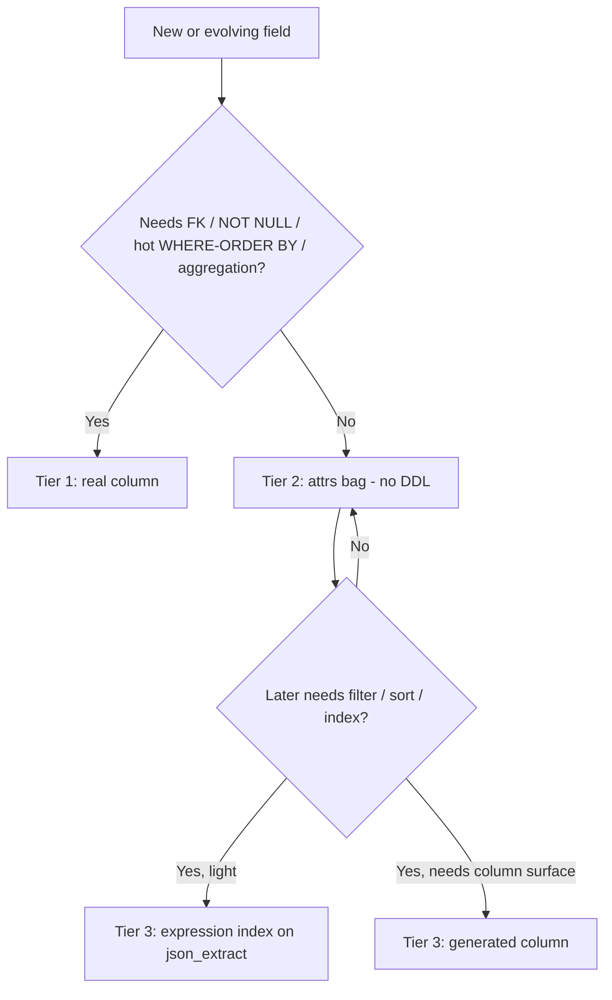
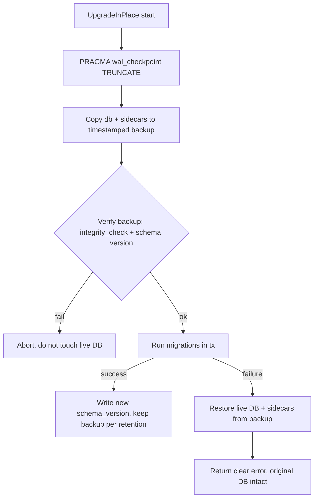
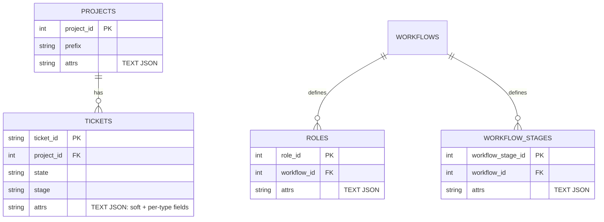
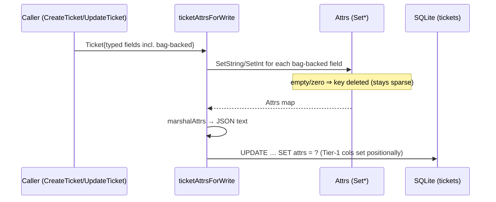
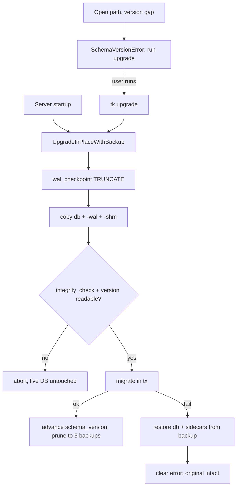

# Extensible Schema: JSON Attribute Bags + Reinforced Migration Safety

> Status: **Design (S1 / TK-106)** — sign-off gate for epic **TK-105**.
> Implementation stories: TK-107 (migration safety), TK-108 (column-list
> centralization), TK-109 (introduce `attrs`), TK-110 (queryable bag),
> TK-111–TK-114 (per-entity consolidation).

## 1. Problem

Adding a single field to a core entity is disproportionately expensive today.
The cost is **not** the `ALTER TABLE` — that is one idempotent line and the
additive migration framework in `internal/store/store.go` already handles it.
The cost is two-fold:

1. **DDL churn / version coupling.** Every optional field needs a schema-version
   bump (`CurrentSchemaVersion` in `internal/store/schema_version.go`) and a
   migration guard, even when the field is sparse, display-only, or specific to
   one ticket type.
2. **Code fan-out.** Columns are listed *positionally* in ~10 hand-written
   `SELECT` statements (`internal/store/ticket.go`, `internal/store/reorder.go`)
   plus a 41-argument `scanTicket`. Adding `started_at` (TK-88) meant threading
   `COALESCE(started_at,'')` through every one of those call sites in the correct
   ordinal position, plus the struct, INSERT/UPDATE, OpenAPI and tests.

We want to lower both the **likelihood** and the **blast radius** of future
schema change, while keeping the schema queryable and safe to migrate.

## 2. Goals & non-goals

**Goals**
- Make the *default* way to add an optional field require **no DDL and no schema
  version bump**.
- Eliminate the positional `SELECT`/scan fan-out so even genuine column changes
  touch one place.
- Keep fields queryable (filter/sort/index) when they need to be.
- Make every migration self-protecting: a verified backup is always taken and a
  failed migration auto-rolls-back.

**Non-goals (this epic)**
- No Postgres / non-SQLite backend.
- No end-user "custom fields" UI (this epic builds the substrate, not the
  feature).
- No change to the lifecycle model (`docs/LIFECYCLE.md`).

## 3. The three-tier model

We deliberately do **not** turn everything into JSON. Untyped JSON bags become
dumping grounds that defeat querying and constraints. Instead we define three
tiers with explicit promotion rules.

### Tier 1 — First-class columns (unchanged)
Real typed columns. Used for anything that needs a **foreign key**, a
**`NOT NULL` constraint**, a **hot-path `WHERE`/`ORDER BY`**, or **aggregation**.
Examples: `state`, `stage`, `status`, `project_id`, `parent_id`, `priority`,
`sort_order`, lifecycle flags (`draft`/`complete`/`archived`/`deleted`),
timestamps.

### Tier 2 — The attribute bag (`attrs`, TEXT JSON)
One `attrs` column per high-churn entity, storing a JSON object. This is the
**default home** for:
- new optional / sparse fields,
- display-only or rarely-queried fields,
- **per-type** fields (a `bug`'s repro steps, a `spike`'s timebox) that would
  otherwise be sparse wide columns.

Adding a Tier-2 field = **add a field to a typed Go accessor struct**. No SQL, no
migration, no version bump.

### Tier 3 — Promotion
When a Tier-2 field starts needing to be filtered / sorted / indexed, it is
*promoted* without a destructive migration:

1. **Expression index** (preferred) — idempotent, no table rewrite:
   ```sql
   CREATE INDEX IF NOT EXISTS idx_tickets_attrs_severity
     ON tickets (json_extract(attrs, '$.severity'));
   ```
2. **Generated column** (heavier, only when a real column surface is required):
   a `GENERATED ALWAYS AS (json_extract(attrs,'$.x')) VIRTUAL` column. Documented
   as the fallback; not implemented unless a concrete need arises.

### Promotion decision tree



### Querying the bag in practice (Tier-3 API)

The promotion mechanism is implemented in `internal/store/attrs_query.go`:

- `ValidAttrsKey(key)` — restricts attrs keys to `[A-Za-z0-9_]+` so a json path can
  never inject SQL. All query/index helpers validate the key before it reaches SQL.
- `EnsureAttrIndex(ctx, db, table, key)` — the promotion action. Idempotently
  creates `idx_<table>_attrs_<key> ON <table>(json_extract(attrs,'$.<key>'))`. No
  table rewrite, no schema-version bump; safe to call repeatedly.
- `ListTicketsByAttr(ctx, db, projectID, key, value)` — a worked example that
  filters and orders tickets on a bag field via `json_extract`; the expression
  index above serves it (verified with `EXPLAIN QUERY PLAN` in the tests).

A consolidation story (S6) that moves a queried column into the bag calls
`EnsureAttrIndex` for that field so existing filters/sorts keep their index.

## 4. Storage format: TEXT JSON (not binary JSONB)

SQLite has no `JSONB` *column type* (unlike Postgres). "JSONB" in SQLite is the
binary on-disk encoding introduced in **SQLite 3.45** (Jan 2024), produced by
`jsonb()` / `jsonb_extract()` and stored in a `BLOB`. Our driver
`modernc.org/sqlite v1.48.0` embeds a SQLite new enough to support it.

The original design (S1) proposed binary JSONB for compactness. During
implementation (S4) we found a blocking problem: **binary JSONB does not survive
the snapshot export/import** used by both the backup/restore feature
(`tk export`/`tk import`) and the migration rebuild path (`UpgradeDatabase`). The
snapshot serializes every column generically via `[]byte → string → JSON`, and
binary JSONB bytes are not valid UTF-8, so a round-tripped value comes back as
"malformed JSON". Data integrity of backups and migrations outranks the marginal
size/speed win of binary encoding.

Decision (revised): **store `attrs` as `TEXT NOT NULL DEFAULT '{}'`**, written as
plain JSON text (`attrs = ?`) and read as text. `json_extract(attrs,'$.path')`
and expression indexes work identically on TEXT, so Tier-3 promotion (§3) is
unchanged. The constant `'{}'` default is also permitted on
`ALTER TABLE ADD COLUMN`, so the migration needs no backfill.

> Coexistence: the existing `dor_map` / `dod_map` / `ac_map` TEXT-JSON columns
> keep working unchanged until S6 folds them into `attrs`. All are TEXT JSON and
> readable by the same `json_*` functions.

## 5. Typed accessor layer

The bag is **not** accessed as a raw `map[string]any` in business logic. Each
entity gets a typed Go struct that marshals to/from `attrs`:

```go
// TicketAttrs is the typed view of tickets.attrs. Adding an optional field here
// requires NO SQL and NO schema-version bump.
type TicketAttrs struct {
    GitRepository    string      `json:"git_repository,omitempty"`
    GitBranch        string      `json:"git_branch,omitempty"`
    EstimateComplete string      `json:"estimate_complete,omitempty"`
    HealthScore      int         `json:"health_score,omitempty"`
    Author           string      `json:"author,omitempty"`
    PrURL            string      `json:"pr_url,omitempty"`
    DOR              GuidanceMap `json:"dor_map,omitempty"`
    DOD              GuidanceMap `json:"dod_map,omitempty"`
    AC               GuidanceMap `json:"ac_map,omitempty"`
    // future optional fields land here — no migration
}
```

- `omitempty` keeps the stored object minimal/sparse.
- Unknown keys are preserved on round-trip where practical (so an older binary
  does not silently drop a newer field) — implemented by retaining a raw
  `map[string]json.RawMessage` overflow alongside the typed struct.
- A shared helper marshals/unmarshals (`encoding/json`) and is the single place
  that talks to the `attrs` column.

## 6. Killing the fan-out (TK-108)

Independent of JSON, the ticket column list and scan are centralized into a
single source of truth:

- One canonical column-list constant/builder used by every read query.
- One scan helper whose scan-target order is guaranteed consistent with that
  list.

After this, adding a Tier-1 column touches the list + struct + scan helper in one
place instead of ~10 SELECTs, and adding `attrs` (TK-109) is a one-line change to
the list.

## 7. Migration safety (TK-107)

Today `BackupDatabase()` does a plain file copy of `.db`/`-wal`/`-shm` before
`UpgradeInPlace()`, but only from the server-startup path
(`cmd/tk/cmd_setup.go:autoUpgradeDatabase`), with **no WAL checkpoint, no
integrity verification, and no rollback**.

Reinforcements:



1. `PRAGMA wal_checkpoint(TRUNCATE)` before copy → self-contained backup.
2. Verify the backup (`PRAGMA integrity_check` + readable schema version) before
   touching the live DB; abort if it fails.
3. Take the backup **inside `UpgradeInPlace`** so every caller is protected.
4. Auto-rollback: restore live DB + sidecars from the verified backup on failure.
5. Timestamped backups with a documented retention policy.
6. Test: inject a deliberately broken migration; assert original DB recovered,
   schema version unchanged, error surfaced.

## 8. Entity model — before & after



## 9. Per-column classification

Legend: **Keep** = stays a Tier-1 column. **Move** = relocate value into `attrs`.
**Fold** = existing TEXT-JSON column merged as a nested key in `attrs`.
Conservative bias: anything filtered / sorted / FK'd / aggregated stays **Keep**.

### 9.1 `tickets`

> **Status (TK-111):** the Move columns below (`git_repository`, `git_branch`,
> `estimate_complete`, `health_score`, `author`, `pr_url`) and the dead `open`
> column have been consolidated into `attrs` and physically dropped. They remain
> typed `Ticket` fields, hydrated from the bag. The `dor_map`/`dod_map`/`ac_map`
> **Fold** is tracked as a separate cross-cutting follow-up (it spans the guidance
> resolution used by tickets, projects and roles).

| Column | Decision | Rationale |
|--------|----------|-----------|
| ticket_id, project_id, parent_id, clone_of | Keep | PK / FKs |
| type, title, description, acceptance_criteria | Keep | core, always present, displayed everywhere |
| workflow_stage_id, role_id, stage, state, status | Keep | hot lifecycle filters |
| priority, sort_order | Keep | sorted/ordered |
| estimate_effort | Keep | aggregation candidate (sums/rollups) |
| draft, complete, archived, deleted | Keep | hot boolean filters |
| previous_workflow_stage_id, previous_role_id, release_id, workflow_id | Keep | FKs / lifecycle |
| assignee, created_by | Keep | filtered |
| recommended_ready, ready | Keep | filtered flags |
| started_at, created_at, updated_at | Keep | sorted timestamps |
| dor_map, dod_map, ac_map | **Fold** | already JSON; natural bag members |
| git_repository, git_branch | **Move** | soft, rarely filtered |
| estimate_complete | **Move** | display date string |
| health_score | **Move** | display metric (promote via index if ever sorted) |
| author | **Move** | soft, display |
| pr_url | **Move** | soft, display |
| `open` (legacy) | **Drop** | dead column, superseded by complete/archived |

### 9.2 `projects`

> **Status (TK-112):** the four `agent_model_*` config columns have been
> consolidated into `attrs` and dropped (typed `Project` fields retained). After
> implementation, `git_repository` and `notes` were reclassified **Keep**:
> `git_repository` is entangled with the `project_git_repositories` sync table and
> the `GetProjectByGitRepository` query, and `notes` is interleaved with kept
> columns in many statements — both better left as columns. The `dor/dod/ac` Fold
> is part of TK-115.

| Column | Decision | Rationale |
|--------|----------|-----------|
| project_id, prefix, title | Keep | PK / identity / displayed |
| status, visibility | Keep | filtered |
| workflow_id, programme_id, default_draft | Keep | FKs / behavior flags |
| ticket_sequence | Keep | sequence counter (mutated atomically) |
| created_by, created_at, updated_at | Keep | identity/sort |
| description, acceptance_criteria | Keep | core, displayed |
| dor_map, dod_map, ac_map | **Fold** | already JSON |
| git_repository, notes | **Move** | soft, display |
| agent_model_provider, agent_model_name, agent_model_url, agent_model_api_key | **Move** | config sub-object → `attrs.agent_model` |

### 9.3 `roles`

| Column | Decision | Rationale |
|--------|----------|-----------|
| role_id, workflow_id, title | Keep | PK / FK / unique identity |
| created_at, updated_at | Keep | sort |
| dor_map, dod_map, ac_map | **Fold** | already JSON |
| description, acceptance_criteria | **Move** | guidance text, never filtered |

### 9.4 `workflow_stages`

| Column | Decision | Rationale |
|--------|----------|-----------|
| workflow_stage_id, workflow_id, stage_name | Keep | PK / FK / unique identity |
| sort_order | Keep | ordering |
| is_backlog_stage | Keep | filtered flag |
| created_at, updated_at | Keep | sort |
| description, acceptance_criteria | **Move** | guidance text |
| definition_of_ready, definition_of_done | **Move** | guidance text |

> Workflow export/import (which serializes stages) must round-trip after the
> move — see TK-114 acceptance criteria.

## 10. Alternatives considered

See ADR `docs/adr/0001-json-attribute-bags.md`. Summary: status-quo additive
columns (rejected: the churn this epic exists to remove), an EAV side table
(rejected: join cost, loss of atomic row, reporting pain), and binary JSONB
(rejected because it does not survive snapshot export/import — see §4; plain TEXT
JSON is the chosen, permanent format).

## 11. Rollout / sequencing

Docs (this story) → migration safety (TK-107) + fan-out refactor (TK-108) →
introduce `attrs` (TK-109) → queryable bag (TK-110) → per-entity consolidation
TK-111 (tickets, first/riskiest) → TK-112/113/114 (projects/roles/stages). Each
story branches from the epic tip and PRs into `epic/extensible-schema`; the epic
PRs into `main` only once all stories land.

### 9.5 Consolidation status summary

| Entity | Consolidated into `attrs` (dropped) | Story |
|--------|--------------------------------------|-------|
| tickets | git_repository, git_branch, estimate_complete, health_score, author, pr_url (+ dead `open`) | TK-111 |
| projects | agent_model_provider, agent_model_name, agent_model_url, agent_model_api_key | TK-112 |
| roles | description, acceptance_criteria, dor_map, dod_map, ac_map | TK-113 |
| workflow_stages | description, acceptance_criteria, definition_of_ready, definition_of_done | TK-114 |

All `dor_map`/`dod_map`/`ac_map` folds are complete across tickets, projects,
roles and workflow_stages (tickets+projects via TK-115; roles+stages via
TK-113/TK-114). `projects.git_repository`/`notes` reclassified Keep.

---

# Part II — Finishing & standardising (epic TK-171)

> Status: **Design (S1 / TK-172)** — sign-off gate for epic **TK-171**.
> Stories: TK-173 (declare-once attrs framework), TK-174 (migrate remaining
> churn columns, verified vs reference DB), TK-175 (verified backup + tested
> rollback on *every* migration entry point), TK-176 (optional Tier-3 generated
> columns).
>
> Part I above describes the **already-shipped** foundation (prior epic
> TK-105/106, stories TK-107–TK-115). This part **builds on it, does not rebuild
> it.** Where Part I states intent, this part records what the code actually does
> today (verified against `internal/store` at schema **v15**) and defines the
> remaining, enforceable convention.

## 12. Current reality (verified against the code, schema v15)

Everything below is present in `internal/store` today; this is the substrate the
TK-171 stories extend.

| Capability | Where | Notes |
|------------|-------|-------|
| Schema version | `schema_version.go` — `CurrentSchemaVersion = 15` | stored in `schema_meta(key,value)` under `schema_version` |
| Additive migrations | `store.go` — `migrateSchema(ctx, db)` | ~74 idempotent guards (`columnExists`/`tableExists`); `PRAGMA foreign_keys=OFF` for the run, restored on exit; additive-only |
| `attrs` bag | `tickets`, `projects`, `roles`, `workflow_stages` | `attrs TEXT NOT NULL DEFAULT '{}'` (never NULL) |
| Typed bag helper | `attrs.go` — `type Attrs map[string]any`; `parseAttrs`, `marshalAttrs`, `GetString/GetInt`, `SetString/SetInt` | `Set*` **delete** empty/zero values → stored object stays sparse |
| Promotion (light) | `attrs_query.go` — `EnsureAttrIndex(ctx, db, table, key)`, `ValidAttrsKey` | idempotent `CREATE INDEX IF NOT EXISTS … json_extract(attrs,'$.key')`; key restricted to `[A-Za-z0-9_]+` (no SQL injection); no version bump |
| Backup-safe upgrade | `schema_version.go` — `UpgradeInPlaceWithBackup(ctx, path)` | WAL `checkpoint(TRUNCATE)` → copy db+`-wal`+`-shm` → `integrity_check` + version verify → migrate → **rollback on failure** → prune to `DefaultBackupRetention = 5` |
| Driver | `modernc.org/sqlite` (pure Go) | JSON1 (`json_extract`/`json_set`) used throughout; no CGO |

**Already living in `tickets.attrs`** (typed `Ticket` fields hydrated from the
bag, not columns): `git_repository`, `git_branch`, `estimate_complete`,
`health_score`, `author`, `pr_url`, and the `dor_map`/`dod_map`/`ac_map`
guidance maps. The dead `open` column was dropped.

## 13. The enforced decision rule (sharpened)

Part I §3 introduces the three tiers. TK-171 makes the rule **prescriptive** —
a checklist a reviewer (human or agent) can apply deterministically to any new
field. Default is **Tier 2**; you must *justify* leaving it.

```
Adding a field F to entity E?

  Does F need ANY of:
    • a FOREIGN KEY to another table,
    • a NOT NULL / UNIQUE / CHECK constraint enforced by the DB,
    • participation in a hot-path WHERE / ORDER BY / JOIN (every list query),
    • SQL-side aggregation (SUM/COUNT/AVG over many rows)?
      └─ YES → Tier 1: real column   (DDL + version bump + scan list edit; rare)
      └─ NO  ↓
  Is F sparse / optional / display-only / per-ticket-type / still evolving?
      └─ YES → Tier 2: attrs bag     (no DDL, no version bump — the DEFAULT)
                 ↓ later …
  Does the Tier-2 field now need filtering/sorting/indexing?
      └─ light (occasional filter)        → Tier 3a: expression index (EnsureAttrIndex)
      └─ needs a typed/indexed column face → Tier 3b: generated column (TK-176)
```

Tie-breakers: when Tier-1 and Tier-2 both *seem* to fit, choose **Tier 2** and
record why in the field's Go doc comment. "We might query it one day" is **not**
a Tier-1 justification — that is exactly the Tier-3a promotion path, which is
cheap and reversible. Tier-1 is reserved for fields that are *structurally*
relational (FK/constraint) or *always* on the hot path.

## 14. Write path and read path (the two diagrams)

The bag is never touched as raw JSON in business logic. A typed struct is the
only public surface; one helper marshals/merges on write, one helper parses and
hydrates on read.

**Write path** — typed struct → attrs merge → row:



**Read path** — row → attrs parse → hydrated struct:

```mermaid
sequenceDiagram
  participant DB as SQLite (tickets)
  participant S as scanTicket
  participant H as hydrateTicketAttrs
  participant Out as Ticket
  DB-->>S: row (31 cols, ticketColumnNames order; attrs last)
  S->>S: parseAttrs(attrsJSON)
  S->>H: Ticket + parsed Attrs
  H->>Out: copy bag keys → typed fields (git_*, pr_url, health_score, …)
  H->>Out: delete those keys from user-visible Attrs (sparse)
  Note over Out: Tier-1 cols already populated by positional scan
```

**The blast radius TK-173/S2 removes.** Today a *bag-backed* field is declared
in **three** hand-maintained places that must stay in lockstep:
`ticketColumnNames`/`scanTicket` are untouched (good — that is the Part I win),
but you still edit (1) the `Ticket` struct field, (2) `hydrateTicketAttrs`
(read), and (3) `ticketAttrsForWrite` (write). Miss one and the field silently
fails to persist or to load. S2's goal: a single declaration (one table of
`{key, accessor}`) that drives both hydrate and write, so a new sparse field is
genuinely a one-liner. This doc is the spec S2 implements against.

## 15. Migration entry points & backup matrix (feeds TK-175/S4)

Epic AC #4 requires a verified backup + tested rollback on **every** migration
entry point. The audit of what exists today:

| Entry point | File | Migrates in place? | Backup taken? |
|-------------|------|--------------------|---------------|
| Server startup | `cmd/tk` — `autoUpgradeDatabase` | Yes (on version gap) | **Yes** — `UpgradeInPlaceWithBackup` |
| `tk upgrade` (CLI/admin) | `cmd/tk` — upgrade command | Yes | **Yes** — `UpgradeInPlaceWithBackup` |
| Local/CLI open | `store.go` — `Open(path)` | **No** — returns `SchemaVersionError` | n/a (refuses; safe-by-refusal) |
| `createSchema` (fresh/empty DB) | `store.go` — `Open` → `createSchema` | n/a — builds at current version | n/a (nothing to lose) |

**Finding:** there is no unprotected in-place migration path today — the local
`Open()` deliberately *refuses* to migrate and tells the user to run the backed-up
upgrade. So S4's work is not "add a missing backup" but:
1. **Lock this in with a test** that fails if any future path migrates without
   first calling `UpgradeInPlaceWithBackup` (regression guard for the matrix).
2. **Prove rollback** by injecting a deliberately-broken migration and asserting
   the live DB + sidecars are restored byte-for-byte, schema version unchanged,
   and a clear error surfaced.
3. **Document the restore procedure** (where backups live, retention = 5, how to
   restore manually) in the user guide.



## 16. Remaining-column audit for `tickets` (feeds TK-174/S3)

Part I §9.1's Move/Fold columns are **already done**. This is the *current*
classification of the live `tickets` table (32 columns at v15) for the "one
schema change this time". The conservative bias holds: structural/relational and
hot-path columns stay Tier-1. The honest conclusion is that **little remains to
move** — the prior epic already harvested the soft fields — so S3 should be
scoped tightly and verified against the reference DB rather than moving columns
for their own sake.

| Column(s) | Decision | Rationale |
|-----------|----------|-----------|
| ticket_id, project_id, parent_id, clone_of | **Keep** | PK / FKs |
| type, title, description, acceptance_criteria | **Keep** | core, always present, displayed everywhere |
| workflow_id, workflow_stage_id, role_id, previous_workflow_stage_id, previous_role_id, release_id | **Keep** | FKs / lifecycle |
| stage, state, status | **Keep** | hot lifecycle filters |
| priority, sort_order | **Keep** | sorted / ordered |
| estimate_effort | **Keep** | aggregation candidate (rollups) |
| draft, complete, archived, deleted | **Keep** | hot boolean filters |
| assignee, created_by | **Keep** | filtered |
| recommended_ready | **Keep** | filtered flag |
| started_at, created_at, updated_at | **Keep** | sorted timestamps |
| attrs | **Keep** | the bag itself |

**S3 candidates to scrutinise (not yet moved):** `clone_of` and `release_id`
are sparse and rarely filtered, but both are FKs — moving them would lose
referential integrity, so they stay Tier-1. `recommended_ready` is a sparse
boolean that *is* filtered (Tier-1 by the rule). **Net: no tickets column is a
clear Move candidate today.** S3's real deliverable is therefore the *proof
harness* — run the (possibly no-op) consolidation against a reference copy of the
production DB and verify row counts and every value round-trip — plus moving any
churn-prone column on `projects`/`roles`/`workflow_stages` that a fresh audit of
those tables surfaces. S3 must **not** invent moves to look busy; an empty,
verified diff is a valid outcome that satisfies "the one schema change runs
cleanly and preserves all data".

## 17. Tier-3 generated columns (feeds TK-176/S5, optional)

Tier-3a (expression index via `EnsureAttrIndex`) ships today. Tier-3b — a
`GENERATED ALWAYS AS (json_extract(attrs,'$.key')) VIRTUAL` column — is still
**documented-only**. S5 is optional and should be built only when a concrete
attrs key needs a first-class typed/indexable column *surface* (e.g. a strict
type for an external tool, or a UNIQUE constraint over a bag key) that an
expression index cannot provide. Acceptance for S5, if taken: a worked example
key promoted to a `VIRTUAL` generated column, an index on it, and a test showing
`EXPLAIN QUERY PLAN` uses the index — with no table rewrite and no data backfill.

## 17a. How to add a Tier-2 field (the declare-once recipe, TK-173)

The scalar attrs framework lives in `internal/store/ticket_attrs.go`. Adding a
new sparse scalar field to a ticket is now **two edits, one of them a one-liner**:

1. Add the typed field + JSON tag to the `Ticket` struct (e.g.
   `RiskNote string \`json:"risk_note,omitempty"\``).
2. Add **one** line to `ticketAttrScalarFields`:
   ```go
   strAttrField("risk_note", func(t *Ticket) *string { return &t.RiskNote }),
   ```
   (or `intAttrField` for an int). That single declaration drives **both**
   hydration (bag → field) and write-back (field → bag, sparse) — there are no
   separate key/hydrate/write lists to keep in sync, and no `scanTicket`/column
   edits because the field never becomes a column. If the field later needs
   filtering/sorting, promote it with `EnsureAttrIndex(ctx, db, "tickets",
   "risk_note")` (Tier-3a) — still no DDL or version bump.

Nested object fields (like the `dor_map`/`dod_map`/`ac_map` guidance maps) have
bespoke marshalling and are folded explicitly in `hydrateTicketAttrs` /
`ticketAttrsForWrite` alongside the registry; only scalars use the one-liner.

## 18. Sign-off checklist (this story, TK-172)

- [x] Three-tier model + **enforced** decision rule (§13) with worked examples.
- [x] Write-path and read-path diagrams (§14); migration/backup flow (§15).
- [x] Current `tickets` column audit at v15 (§16) feeding S3.
- [x] Current reality documented accurately (§12): v15, `schema_meta`,
      `migrateSchema` guards, `Attrs`/`EnsureAttrIndex`, `UpgradeInPlaceWithBackup`,
      modernc JSON1.
- [ ] Reviewed & agreed before Stories TK-173–TK-176 begin (human gate).
