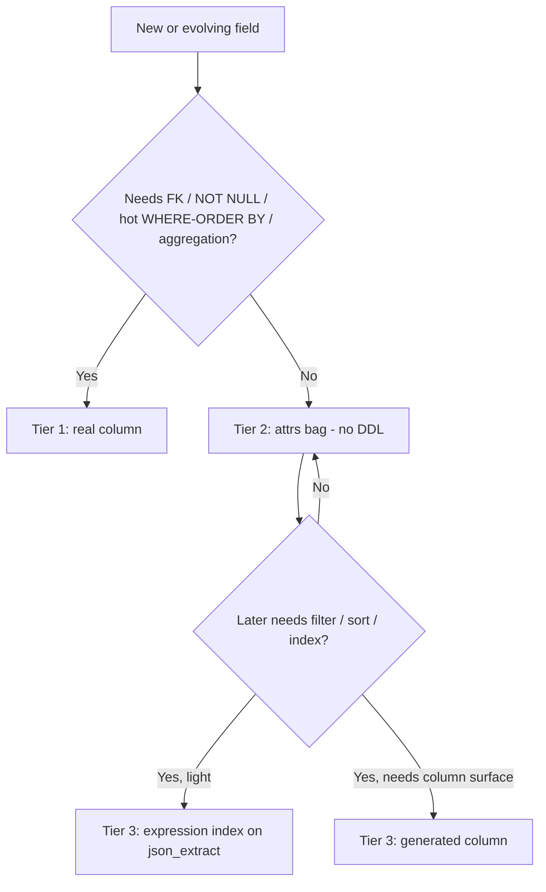
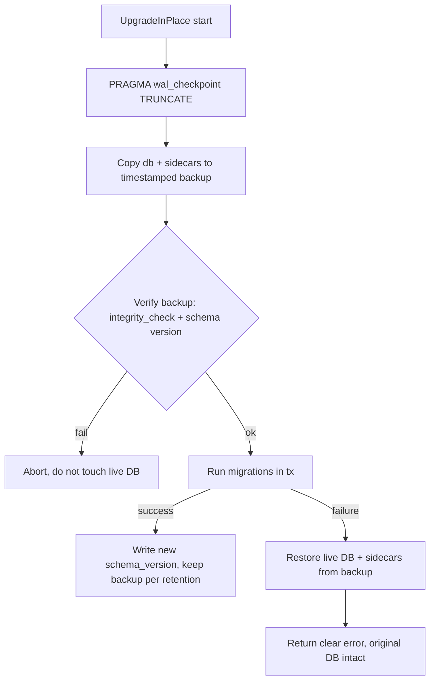
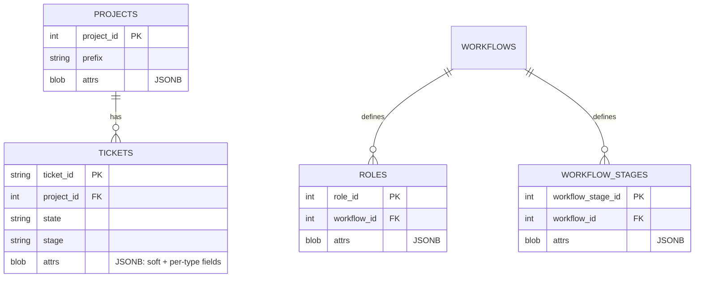

# Extensible Schema: JSON Attribute Bags + Reinforced Migration Safety

> Status: **Design (S1 / TK-106)** — sign-off gate for epic **TK-105**.
> Implementation stories: TK-107 (migration safety), TK-108 (column-list
> centralization), TK-109 (introduce `attrs`), TK-110 (queryable bag),
> TK-111–TK-114 (per-entity consolidation).

## 1. Problem

Adding a single field to a core entity is disproportionately expensive today.
The cost is **not** the `ALTER TABLE` — that is one idempotent line and the
additive migration framework in `internal/store/store.go` already handles it.
The cost is two-fold:

1. **DDL churn / version coupling.** Every optional field needs a schema-version
   bump (`CurrentSchemaVersion` in `internal/store/schema_version.go`) and a
   migration guard, even when the field is sparse, display-only, or specific to
   one ticket type.
2. **Code fan-out.** Columns are listed *positionally* in ~10 hand-written
   `SELECT` statements (`internal/store/ticket.go`, `internal/store/reorder.go`)
   plus a 41-argument `scanTicket`. Adding `started_at` (TK-88) meant threading
   `COALESCE(started_at,'')` through every one of those call sites in the correct
   ordinal position, plus the struct, INSERT/UPDATE, OpenAPI and tests.

We want to lower both the **likelihood** and the **blast radius** of future
schema change, while keeping the schema queryable and safe to migrate.

## 2. Goals & non-goals

**Goals**
- Make the *default* way to add an optional field require **no DDL and no schema
  version bump**.
- Eliminate the positional `SELECT`/scan fan-out so even genuine column changes
  touch one place.
- Keep fields queryable (filter/sort/index) when they need to be.
- Make every migration self-protecting: a verified backup is always taken and a
  failed migration auto-rolls-back.

**Non-goals (this epic)**
- No Postgres / non-SQLite backend.
- No end-user "custom fields" UI (this epic builds the substrate, not the
  feature).
- No change to the lifecycle model (`docs/LIFECYCLE.md`).

## 3. The three-tier model

We deliberately do **not** turn everything into JSON. Untyped JSON bags become
dumping grounds that defeat querying and constraints. Instead we define three
tiers with explicit promotion rules.

### Tier 1 — First-class columns (unchanged)
Real typed columns. Used for anything that needs a **foreign key**, a
**`NOT NULL` constraint**, a **hot-path `WHERE`/`ORDER BY`**, or **aggregation**.
Examples: `state`, `stage`, `status`, `project_id`, `parent_id`, `priority`,
`sort_order`, lifecycle flags (`draft`/`complete`/`archived`/`deleted`),
timestamps.

### Tier 2 — The attribute bag (`attrs`, JSONB)
One `attrs` column per high-churn entity, storing a JSON object. This is the
**default home** for:
- new optional / sparse fields,
- display-only or rarely-queried fields,
- **per-type** fields (a `bug`'s repro steps, a `spike`'s timebox) that would
  otherwise be sparse wide columns.

Adding a Tier-2 field = **add a field to a typed Go accessor struct**. No SQL, no
migration, no version bump.

### Tier 3 — Promotion
When a Tier-2 field starts needing to be filtered / sorted / indexed, it is
*promoted* without a destructive migration:

1. **Expression index** (preferred) — idempotent, no table rewrite:
   ```sql
   CREATE INDEX IF NOT EXISTS idx_tickets_attrs_severity
     ON tickets (json_extract(attrs, '$.severity'));
   ```
2. **Generated column** (heavier, only when a real column surface is required):
   a `GENERATED ALWAYS AS (json_extract(attrs,'$.x')) VIRTUAL` column. Documented
   as the fallback; not implemented unless a concrete need arises.

### Promotion decision tree



### Querying the bag in practice (Tier-3 API)

The promotion mechanism is implemented in `internal/store/attrs_query.go`:

- `ValidAttrsKey(key)` — restricts attrs keys to `[A-Za-z0-9_]+` so a json path can
  never inject SQL. All query/index helpers validate the key before it reaches SQL.
- `EnsureAttrIndex(ctx, db, table, key)` — the promotion action. Idempotently
  creates `idx_<table>_attrs_<key> ON <table>(json_extract(attrs,'$.<key>'))`. No
  table rewrite, no schema-version bump; safe to call repeatedly.
- `ListTicketsByAttr(ctx, db, projectID, key, value)` — a worked example that
  filters and orders tickets on a bag field via `json_extract`; the expression
  index above serves it (verified with `EXPLAIN QUERY PLAN` in the tests).

A consolidation story (S6) that moves a queried column into the bag calls
`EnsureAttrIndex` for that field so existing filters/sorts keep their index.

## 4. Storage format: TEXT JSON (not binary JSONB)

SQLite has no `JSONB` *column type* (unlike Postgres). "JSONB" in SQLite is the
binary on-disk encoding introduced in **SQLite 3.45** (Jan 2024), produced by
`jsonb()` / `jsonb_extract()` and stored in a `BLOB`. Our driver
`modernc.org/sqlite v1.48.0` embeds a SQLite new enough to support it.

The original design (S1) proposed binary JSONB for compactness. During
implementation (S4) we found a blocking problem: **binary JSONB does not survive
the snapshot export/import** used by both the backup/restore feature
(`tk export`/`tk import`) and the migration rebuild path (`UpgradeDatabase`). The
snapshot serializes every column generically via `[]byte → string → JSON`, and
binary JSONB bytes are not valid UTF-8, so a round-tripped value comes back as
"malformed JSON". Data integrity of backups and migrations outranks the marginal
size/speed win of binary encoding.

Decision (revised): **store `attrs` as `TEXT NOT NULL DEFAULT '{}'`**, written as
plain JSON text (`attrs = ?`) and read as text. `json_extract(attrs,'$.path')`
and expression indexes work identically on TEXT, so Tier-3 promotion (§3) is
unchanged. The constant `'{}'` default is also permitted on
`ALTER TABLE ADD COLUMN`, so the migration needs no backfill.

> Coexistence: the existing `dor_map` / `dod_map` / `ac_map` TEXT-JSON columns
> keep working unchanged until S6 folds them into `attrs`. All are TEXT JSON and
> readable by the same `json_*` functions.

## 5. Typed accessor layer

The bag is **not** accessed as a raw `map[string]any` in business logic. Each
entity gets a typed Go struct that marshals to/from `attrs`:

```go
// TicketAttrs is the typed view of tickets.attrs. Adding an optional field here
// requires NO SQL and NO schema-version bump.
type TicketAttrs struct {
    GitRepository    string      `json:"git_repository,omitempty"`
    GitBranch        string      `json:"git_branch,omitempty"`
    EstimateComplete string      `json:"estimate_complete,omitempty"`
    HealthScore      int         `json:"health_score,omitempty"`
    Author           string      `json:"author,omitempty"`
    PrURL            string      `json:"pr_url,omitempty"`
    DOR              GuidanceMap `json:"dor_map,omitempty"`
    DOD              GuidanceMap `json:"dod_map,omitempty"`
    AC               GuidanceMap `json:"ac_map,omitempty"`
    // future optional fields land here — no migration
}
```

- `omitempty` keeps the stored object minimal/sparse.
- Unknown keys are preserved on round-trip where practical (so an older binary
  does not silently drop a newer field) — implemented by retaining a raw
  `map[string]json.RawMessage` overflow alongside the typed struct.
- A shared helper marshals/unmarshals (`encoding/json`) and is the single place
  that talks to the `attrs` column.

## 6. Killing the fan-out (TK-108)

Independent of JSON, the ticket column list and scan are centralized into a
single source of truth:

- One canonical column-list constant/builder used by every read query.
- One scan helper whose scan-target order is guaranteed consistent with that
  list.

After this, adding a Tier-1 column touches the list + struct + scan helper in one
place instead of ~10 SELECTs, and adding `attrs` (TK-109) is a one-line change to
the list.

## 7. Migration safety (TK-107)

Today `BackupDatabase()` does a plain file copy of `.db`/`-wal`/`-shm` before
`UpgradeInPlace()`, but only from the server-startup path
(`cmd/tk/cmd_setup.go:autoUpgradeDatabase`), with **no WAL checkpoint, no
integrity verification, and no rollback**.

Reinforcements:



1. `PRAGMA wal_checkpoint(TRUNCATE)` before copy → self-contained backup.
2. Verify the backup (`PRAGMA integrity_check` + readable schema version) before
   touching the live DB; abort if it fails.
3. Take the backup **inside `UpgradeInPlace`** so every caller is protected.
4. Auto-rollback: restore live DB + sidecars from the verified backup on failure.
5. Timestamped backups with a documented retention policy.
6. Test: inject a deliberately broken migration; assert original DB recovered,
   schema version unchanged, error surfaced.

## 8. Entity model — before & after



## 9. Per-column classification

Legend: **Keep** = stays a Tier-1 column. **Move** = relocate value into `attrs`.
**Fold** = existing TEXT-JSON column merged as a nested key in `attrs`.
Conservative bias: anything filtered / sorted / FK'd / aggregated stays **Keep**.

### 9.1 `tickets`

| Column | Decision | Rationale |
|--------|----------|-----------|
| ticket_id, project_id, parent_id, clone_of | Keep | PK / FKs |
| type, title, description, acceptance_criteria | Keep | core, always present, displayed everywhere |
| workflow_stage_id, role_id, stage, state, status | Keep | hot lifecycle filters |
| priority, sort_order | Keep | sorted/ordered |
| estimate_effort | Keep | aggregation candidate (sums/rollups) |
| draft, complete, archived, deleted | Keep | hot boolean filters |
| previous_workflow_stage_id, previous_role_id, release_id, workflow_id | Keep | FKs / lifecycle |
| assignee, created_by | Keep | filtered |
| recommended_ready, ready | Keep | filtered flags |
| started_at, created_at, updated_at | Keep | sorted timestamps |
| dor_map, dod_map, ac_map | **Fold** | already JSON; natural bag members |
| git_repository, git_branch | **Move** | soft, rarely filtered |
| estimate_complete | **Move** | display date string |
| health_score | **Move** | display metric (promote via index if ever sorted) |
| author | **Move** | soft, display |
| pr_url | **Move** | soft, display |
| `open` (legacy) | **Drop** | dead column, superseded by complete/archived |

### 9.2 `projects`

| Column | Decision | Rationale |
|--------|----------|-----------|
| project_id, prefix, title | Keep | PK / identity / displayed |
| status, visibility | Keep | filtered |
| workflow_id, programme_id, default_draft | Keep | FKs / behavior flags |
| ticket_sequence | Keep | sequence counter (mutated atomically) |
| created_by, created_at, updated_at | Keep | identity/sort |
| description, acceptance_criteria | Keep | core, displayed |
| dor_map, dod_map, ac_map | **Fold** | already JSON |
| git_repository, notes | **Move** | soft, display |
| agent_model_provider, agent_model_name, agent_model_url, agent_model_api_key | **Move** | config sub-object → `attrs.agent_model` |

### 9.3 `roles`

| Column | Decision | Rationale |
|--------|----------|-----------|
| role_id, workflow_id, title | Keep | PK / FK / unique identity |
| created_at, updated_at | Keep | sort |
| dor_map, dod_map, ac_map | **Fold** | already JSON |
| description, acceptance_criteria | **Move** | guidance text, never filtered |

### 9.4 `workflow_stages`

| Column | Decision | Rationale |
|--------|----------|-----------|
| workflow_stage_id, workflow_id, stage_name | Keep | PK / FK / unique identity |
| sort_order | Keep | ordering |
| is_backlog_stage | Keep | filtered flag |
| created_at, updated_at | Keep | sort |
| description, acceptance_criteria | **Move** | guidance text |
| definition_of_ready, definition_of_done | **Move** | guidance text |

> Workflow export/import (which serializes stages) must round-trip after the
> move — see TK-114 acceptance criteria.

## 10. Alternatives considered

See ADR `docs/adr/0001-json-attribute-bags.md`. Summary: status-quo additive
columns (rejected: the churn this epic exists to remove), an EAV side table
(rejected: join cost, loss of atomic row, reporting pain), and plain TEXT JSON
(rejected in favour of JSONB for size/speed; TEXT retained only transitionally).

## 11. Rollout / sequencing

Docs (this story) → migration safety (TK-107) + fan-out refactor (TK-108) →
introduce `attrs` (TK-109) → queryable bag (TK-110) → per-entity consolidation
TK-111 (tickets, first/riskiest) → TK-112/113/114 (projects/roles/stages). Each
story branches from the epic tip and PRs into `epic/extensible-schema`; the epic
PRs into `main` only once all stories land.
