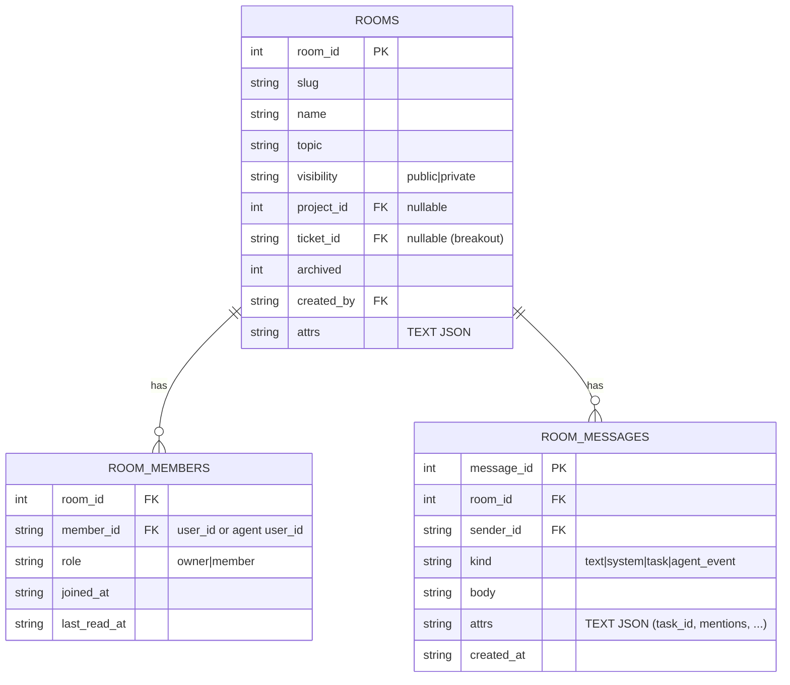

# Multiplayer rooms (Slack-style) with taskable agents

Status: design (TK-118 / S1 = TK-119). Authoritative spec for the rooms feature.

## 1. Goal

Real-time multiplayer chat with **rooms** you create, join, and leave, where
**humans and agents** collaborate. Agents are first-class room members that can
(a) **converse** live in the room and (b) be **tasked** with tracked work via
`/task`, which creates a ticket assigned to the agent; the existing
orchestrator/agent loop does the work and reports progress + result back into the
room.

## 2. Scope model — one `rooms` table, three scopes

A room carries an optional `project_id` and optional `ticket_id`:

| Scope        | project_id | ticket_id | Example |
|--------------|-----------|-----------|---------|
| **global**   | null      | null      | `#general`, `#random` |
| **project**  | set       | null      | a project's `#ops` channel |
| **breakout** | set       | set       | a room around epic `TK-118` |

Membership and visibility are independent of scope: every room is `public`
(discoverable + joinable) or `private` (invite-only). Project/breakout rooms
default their joinable audience to members with access to the project, but the
room is still its own membership list.

## 3. Data model



Notes:
- Agents and humans share the `users` id space (an agent is found by
  `GetUserByUsername`), so `member_id`/`sender_id` reference users uniformly; a
  member's `is_agent` is derived from the user record.
- `attrs` follows the extensible-schema convention (see
  `docs/design/extensible-schema.md`): per-message `task_id`, `mentions[]`, and
  agent-event payloads live there — no migration to add message metadata.
- `kind`: `text` (human/agent chat), `system` (joins/leaves/topic changes),
  `task` (a `/task` was issued), `agent_event` (orchestrator progress/result).

## 4. Realtime — room-scoped WebSocket hub (S4)

A hub keyed by `room_id`. On join, a client subscribes; the hub broadcasts to the
room's connected members only:
- `message` — a new `room_message`
- `presence` — member joined/left/online/offline
- `typing` — transient typing indicator
- `agent_event` — orchestrator progress for a tasked ticket

Built on the existing `chat_ws.go` connection patterns (upgrade, read/write
pumps, heartbeat) but membership/broadcast aware. Auth reuses the session/bearer
(humans) and Basic (agents) model.

## 5. Agents in rooms

### 5a. Conversational (S6)
An agent member responds when **@-mentioned**. The server starts a per-room agent
bridge (reusing the `chat_ws.go` process bridge) seeded with the recent room
transcript + the mention; the agent's streamed reply is posted as `room_messages`
of kind `text` (sender = the agent) and broadcast live. Typing/presence reflect
the agent.

### 5b. Tasked — `/task` (S7)
`/task @agent <description>` in a room:
1. Creates a **ticket** (type `task`) — scoped to the room's `project_id` (and
   parented to `ticket_id` for breakout rooms); falls back to a default project
   for global rooms.
2. Assigns the agent and links ticket ↔ room (`room_messages.attrs.task_id`, and
   the ticket records the originating room).
3. The existing **orchestrator/agent** picks it up; lifecycle transitions and the
   completion/PR are posted back into the room as `agent_event` / `system`
   messages. The room becomes the live feed for that ticket's progress.

This reuses the entire ticket lifecycle, audit trail, and PR flow — chat is just
the originating + reporting surface.

## 6. REST API (S3)

```
POST   /api/rooms                      create
GET    /api/rooms                      list (scope + visibility + membership filters)
GET    /api/rooms/{id}                 detail
PATCH  /api/rooms/{id}                 rename/topic/visibility
DELETE /api/rooms/{id}                 archive
POST   /api/rooms/{id}/join            join
POST   /api/rooms/{id}/leave           leave
GET    /api/rooms/{id}/members         members (+ presence)
POST   /api/rooms/{id}/members         invite (user or agent)
GET    /api/rooms/{id}/messages        history (paginated, before/after cursor)
POST   /api/rooms/{id}/messages        post a message (also the /task entrypoint)
GET    /api/rooms/ws?room={id}         upgrade to the room WebSocket
```

## 7. Web UI (S5)

Slack-like view in the SPA (`data-view="chat"`): left sidebar lists rooms grouped
by scope (Global / This project / Breakouts), a message feed with sender avatars +
agent badges, a composer supporting `@mentions` and `/task`/`/`-commands, a
members panel with presence, and create/join/leave controls. Live over the WS hub.

## 8. Command palette integration (TK-127)

Double-Shift opens a global quick-switcher; slash-shortcuts route to SPA views via
a command **registry**. The chat view self-registers `/chat`; existing views
register `/backlog` (tickets), `/board`, `/projects`, `/workflows`, etc. The
palette is shipped independently (TK-127) and the rooms view plugs `/chat` into it
in S5.

## 9. Story sequencing

S1 design (this) → S2 schema/store → S3 REST → S4 WS hub → S5 web UI →
S6 conversational agents → S7 `/task` → S8 breakout rooms. Each story branches off
the epic branch and PRs into it; the epic merges to `main` once green.
